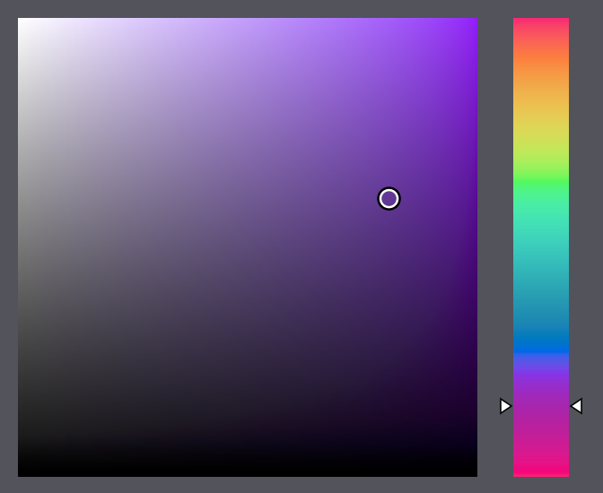

# Svelte Color Select

Okhsv Color Selection component for Svelte using OKLab perceptual colorspace.

Based on the work of [Björn Ottosson](https://bottosson.github.io/) and adapted to work as a Svelte component. See [Okhsv and Okhsl - Two new color spaces for color picking](https://bottosson.github.io/posts/colorpicker/) for more information about Okhsv and Oklab.



## Usage

Installing your package manager of choice:

    pnpm i svelte-color-select

Import into your component and bind `r`, `g`, and `b` values to it:

```html
<script lang="ts">
	import ColorSelect from 'svelte-color-select`

	let r = 102
	let g = 51
	let b = 153
</script>

<ColorSelect bind:r bind:g bind:b />
```
